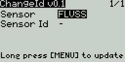

# Change Frsky sensor Id

Lua script to change Frsky sensor id from the radio (ported from erskyTx. Thanks to MikeB)

This is a one-time script. Copy the file chgId.lua to SCRIPTS folder in the sdcard and execute as one-time script from SD-CARD screen (long press and Execute). It can be executed also as telemetry script (only Taranis) if copied to TELEMETRY folder and assigned to a model's telemetry screen

- Connect the sensors to receiver smartport (does not work with the smartport on the radio)
- Multiple sensors can be connected. Do not connect more than one sensor per type (e.g. two FLVSS) or both will change to the same sensor id
- Once selected the sensor type, the sensor id is read
- Then change the sensor id and long press Menu to update
- It may be needed to repeat the process if the sensor id is not updated
- If telemetry is lost after change id, restart Rx and Tx
- For X7, X9, X-lite and Horus radios with opentx 2.2 or higher

