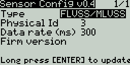
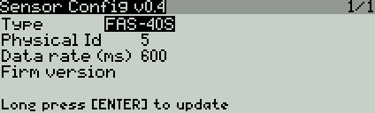
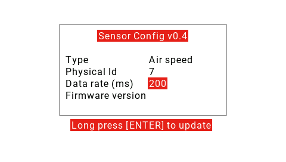

# Sensor config Frsky

Lua script to change Frsky sensor config from the radio (ported from erskyTx. Thanks to MikeB)

This is a one-time script. Copy the file chgId.lua to SCRIPTS folder in the sdcard and execute as one-time script from SD-CARD screen (long press and Execute). Since opentx 2.3 copy to SCRIPTS/TOOLS for easier access. It can be executed also as telemetry script (only Taranis) if copied to TELEMETRY folder and assigned to a model's telemetry screen

- Connect the sensors to receiver smartport (does not work with the smartport on the radio)
- Multiple sensors can be connected. Do not connect more than one sensor per type (e.g. two FLVSS) or both will change to the same sensor id
- Once selected the sensor type, the sensor id is read
- Then change the sensor id and long press Menu or Enter to update
- It may be needed to repeat the process if the sensor id is not updated
- If telemetry is lost after change id, restart Rx and Tx
- For X7, X9, X-lite and Horus radios with opentx 2.2 or higher

Change log:

v0.4
- Added refresh rate and firmware version
- Changed name to Sensor Config
- Improved protocol

[v0.3.2](https://github.com/dgatf/change_id_frsky/tree/0.3.1)
- Added support for [MSRC](https://github.com/dgatf/msrc)

[v0.3.1](https://github.com/dgatf/change_id_frsky/tree/0.3.1)
- X8R2ANA sensor bug fixed
 
[v0.3](https://github.com/dgatf/change_id_frsky/tree/0.3)
- Protocol updated. Much faster and reliable

[v0.2.1](https://github.com/dgatf/change_id_frsky/tree/0.2.1)
- Added key MENU for updating as telemetry script

[v0.2](https://github.com/dgatf/change_id_frsky/tree/0.2.0)
- Support for X-lite and Horus added
- Script type changed to one-time
- Sensor X8R2ANA added
